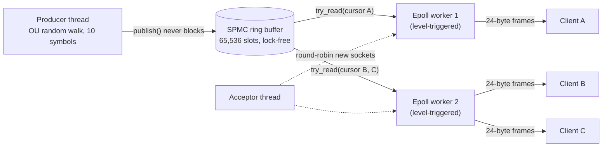

# Concurrent Market Data Distribution Engine

A C++20 engine that generates synthetic market ticks and fans every tick out
to every connected TCP client. At its core is a lock-free
single-producer / multi-consumer (SPMC) ring buffer. When a consumer falls
behind, the oldest unread ticks are dropped and counted; the producer is
never blocked.

- **Tests:** 30 GoogleTest cases (unit + real-socket integration), plus
  TSan/ASan/Helgrind runs. See [TESTING.md](TESTING.md).
- **Benchmarks:** throughput and P50/P99/P99.9 latency at 1, 4 and 12
  consumers, 5 runs each, plus a perf profile. See [BENCHMARKS.md](BENCHMARKS.md).

## Architecture



Same thing as text:

```
 Producer ──publish──▶ [ SPMC ring, 65,536 × 64 B slots ] 
                          │           │            │
                   cursor A     cursor B     cursor C      (one cursor + drop counter per client)
                          │           │            │
                  ┌───────┴──┐  ┌─────┴────────────┴──┐
                  │ worker 1 │  │      worker 2        │  (own epoll fd each, busy-polls the ring)
                  └────┬─────┘  └────┬────────────┬────┘
            64 KB queue│   64 KB queue│   64 KB queue│
                       ▼              ▼            ▼
                    client A       client B     client C   (TCP, TCP_NODELAY)
```

| Module | Files | Role |
|---|---|---|
| `ring_buffer/` | `include/ring_buffer/spmc_ring_buffer.hpp` | Lock-free SPMC ring (header-only template) |
| `protocol/` | `include/protocol/tick.hpp` | `TickMessage`, `encode_tick` / `decode_tick` |
| `producer/` | `include/producer/`, `src/producer/` | Ornstein-Uhlenbeck price walk per symbol, rate limiting |
| `network/` | `include/network/`, `src/network/` | Acceptor + epoll worker pool, broadcast, disconnect handling |
| `client/` | `include/client/`, `src/client/` | TCP client / test harness: throughput + per-message latency |
| — | `src/main_server.cpp`, `src/main_client.cpp` | CLI binaries |

### Threads
- **Producer** (1): steps each symbol's price with a discretized
  Ornstein-Uhlenbeck (mean-reverting) process, round-robin across symbols,
  and stamps each tick with `system_clock` nanoseconds. It is either
  rate-limited (`--rate N`) or unthrottled (`--rate 0`).
- **Acceptor** (1): `accept4()` on a non-blocking listen socket and hands each
  new client to a worker, round-robin.
- **Workers** (`--workers`, default = hardware threads / 2): each owns an
  epoll instance and a set of clients. Each pass, the worker handles socket
  events (hang-ups, errors, EPOLLOUT) and then, for each of its clients,
  drains that client's ring cursor into the client's send queue and flushes
  it with non-blocking `send()`. Each worker's client map is guarded by a per-worker
  `std::mutex`. Only the acceptor (adding a client) and the once-per-second
  stats read ever contend for it; the ring buffer path itself takes no locks.

### Ring buffer
Each slot holds the payload (as `std::atomic<uint64_t>` words) and an atomic
**stamp**: 0 = never written, `s + 1` = holds the item with publish sequence
`s`, and a reserved `BUSY` value while being overwritten. It works like a
per-slot seqlock:

- **Producer:** `stamp = BUSY` → release fence → write words (relaxed) →
  `stamp = s + 1` (release) → `head = s + 1` (release).
- **Consumer** (private cursor `n`): `stamp` (acquire) → copy words (relaxed)
  → acquire fence → re-read `stamp`. If the stamp is unchanged and equals
  `n + 1`, the copy is good. A smaller stamp means nothing new yet; a larger
  one means the consumer was **lapped**: it adds `(head − Capacity) − n` to
  its `dropped` counter and jumps to the oldest item still in the ring.

No mutexes, no CAS loops, and consumers never write shared state, so they
don't contend with each other or with the producer. Capacity must be a power
of two (`static_assert`), so `seq & (Capacity − 1)` picks the slot. Slots are
64-byte aligned to avoid false sharing.

## Design decisions

**Drop-oldest, never block the producer.** In market data, a stale price is
worth less than a fresh one, and one slow subscriber must not delay all the
others. A blocking or bounded-wait producer would let the slowest client set
the pace for everyone. So the producer always overwrites, and a lagging
consumer learns it was lapped, skips to the oldest surviving tick, and counts
exactly how many it missed. The per-client send queue is capped at
**64 KB** for the same reason. A larger queue (it was 8 MB) just delivers old
data late instead of dropping it.

**Level-triggered epoll.** Workers busy-poll the ring and use epoll mainly
for hang-up/error detection and EPOLLOUT when a socket is full. With
level-triggered mode, a partially handled event is simply reported again on
the next `epoll_wait`, so there is no "must drain until EAGAIN" invariant to
get wrong (a classic edge-triggered bug that stalls a connection forever).
EPOLLOUT is only armed while a client has queued bytes, so a
level-triggered writable socket does not spin the loop.

**Fixed-size framing (24 bytes, no length prefix).** Every message is the
same size, so the receiver splits the stream with pure arithmetic: no
parsing, no partial-header states, no allocation. Each field has a fixed
offset, so encode/decode is a handful of moves. The cost is no room for
optional fields or versioning without a new message size.

**Full broadcast, no per-symbol subscriptions.** Every client gets every tick.
That makes the fan-out path trivial (one cursor per client, no filtering or
per-symbol routing) and makes the benchmark a clean measure of distribution
cost. Subscription filtering would be the natural next step.

**Disconnect handling.** Clients are registered with
`EPOLLIN | EPOLLRDHUP`. `EPOLLHUP`, `EPOLLERR`, `EPOLLRDHUP`, a 0-byte
`recv`, or a hard `send()` error removes that one client: its fd is closed and
its cursor dropped, with its sent/dropped totals folded into the server
stats. Other clients on the same worker are unaffected; integration tests
cover FIN and RST disconnects mid-stream.

## Wire format

Every message is exactly 24 bytes, sent back to back on the TCP stream with
no length prefix. All fields are little-endian; see `encode_tick` /
`decode_tick` in `include/protocol/tick.hpp`.

| Offset | Size | Field          | Type                                                  |
|-------:|-----:|----------------|-------------------------------------------------------|
| 0      | 4    | `symbol_id`    | `uint32`                                              |
| 4      | 8    | `price`        | IEEE-754 binary64 (`double`)                          |
| 12     | 4    | `size`         | `uint32`                                              |
| 16     | 8    | `timestamp_ns` | `uint64`, ns since Unix epoch (producer wall clock)   |

```
 0         4                          12        16                         24
 +---------+--------------------------+---------+--------------------------+
 |symbol_id|          price           |  size   |       timestamp_ns       |
 +---------+--------------------------+---------+--------------------------+
```

## Build

Requires Linux (epoll), a C++20 compiler (tested with GCC 13.3) and CMake
≥ 3.16. GoogleTest is downloaded by CMake at configure time.

```bash
cmake -B build -DCMAKE_BUILD_TYPE=Release     # -O3
cmake --build build -j
```

Options: `-DMDE_ENABLE_TSAN=ON`, `-DMDE_ENABLE_ASAN=ON`,
`-DMDE_ENABLE_COVERAGE=ON`, `-DMDE_BUILD_TESTS=OFF`. Use a separate build
directory for each.

## Run

```bash
# server: 10 symbols, 200k ticks/s, 2 worker threads
./build/market_data_server --port 9001 --rate 200000 --workers 2 --symbols 10
# client harness: 4 concurrent connections for 10 s
./build/market_data_client --host 127.0.0.1 --port 9001 --clients 4 --duration 10
```

The server prints a `STATS` line every second and a `FINAL` line on
SIGINT/SIGTERM. The client prints aggregate/per-consumer throughput and
P50/P99/P99.9/max latency over every received message (nearest-rank, so
each percentile is a real observed sample). It stores 8 bytes per message
for this. For long, high-rate load generation, pass `--record-latency 0`.

## Test

```bash
ctest --test-dir build --output-on-failure
```

Sanitizer, Helgrind and coverage instructions are in [TESTING.md](TESTING.md).

## Benchmarks

```bash
scripts/run_benchmarks.sh                       # 1/4/12 consumers × steady/stress × 5 runs
python3 scripts/summarize_benchmarks.py bench/results/codespace
scripts/run_perf.sh                             # perf stat + perf record (needs sudo)
```

Results, hardware details and analysis are in [BENCHMARKS.md](BENCHMARKS.md).
Medians of 5 runs on a 4-vCPU (2-core) GitHub Codespace, with server and
clients on the same VM:

| Consumers | Steady 200k/s: per-consumer ticks/s, P50 / P99 | Unthrottled: aggregate ticks/s, dropped |
|---:|---|---|
| 1  | 199,999, 31.5 µs / 1,499.6 µs | 11,167,068, 0.06% |
| 4  | 200,000, 53.6 µs / 1,345.8 µs | 37,949,293, 2.86% |
| 12 | 200,003, 84.3 µs / 1,959.0 µs | 46,068,855, 56.75% |

The millisecond P99 and the 12-consumer drops come from CPU
oversubscription on this small VM (busy-polling workers + 12 client threads
on 4 vCPUs), which BENCHMARKS.md measures and explains.
